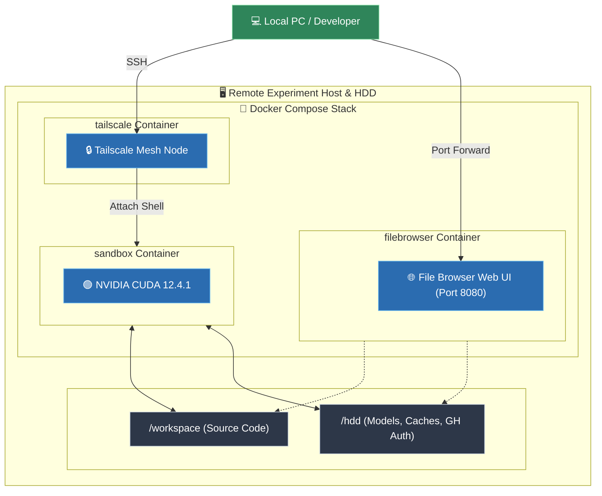

# AI Research Sandbox Template

<p align="center">
  <b>AI研究でよく使うツールを集めた開発環境の Docker 開発テンプレート</b>
</p>

<p align="center">
  <a href="https://developer.nvidia.com/cuda-toolkit"></a>
  <a href="https://github.com/astral-sh/uv"></a>
  <a href="https://github.com/LazyVim/LazyVim"></a>
  <a href="https://zellij.dev/"></a>
  <a href="https://tailscale.com/"></a>
  <a href="https://www.docker.com/"></a>
</p>


## クイックスタート

### 1. 環境変数の設定
リポジトリをクローン後、`.env.example` をコピーして設定ファイルを作成します。

```bash
cp .env.example .env
```

### 2. コンテナの起動
Docker Compose で開発環境と可視化サービスを一括起動します。

```bash
docker compose up -d --build
```

### 3. 開発セッションの開始
コンテナに入り、Neovim や Zellij を起動します。

```bash
# Zellij でマルチペイン開発環境を立ち上げる 
docker compose exec sandbox zellij

# または直接 Neovim を起動
docker compose exec sandbox nvim
```


## ディレクトリ構成

```text
.
├── Dockerfile              # NVIDIA CUDA 12.4 + LazyVim + Zellij + AI Tools の定義
├── docker-compose.yml      # sandbox, filebrowser, tailscale のサービス定義
├── .env.example            # パスやポートの設定テンプレート
├── README.md               # プロジェクトドキュメント
└── (HDD_PATH)/             # 外部ストレージ上の永続化ディレクトリ (コンテナ内 /hdd)
    ├── workspace/          # [ホスト <-> コンテナ /workspace] 同期ディレクトリ
    ├── cache/              # uv, huggingface, npm, dvc, gh のキャッシュ
    └── models/             # 大型モデル保存領域
```

## アーキテクチャ


